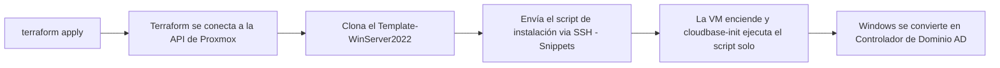

<div align="center">

### 🌐 Elige tu idioma / Choose your language / Escolha o idioma

[🇧🇷 Português](README.md) &nbsp;|&nbsp; [🇺🇸 English](README.en.md) &nbsp;|&nbsp; [🇪🇸 **Español**](README.es.md)

</div>

<div align="center">


# Active Directory automatizado en Proxmox con Terraform

</div>

Este proyecto usa **Terraform** para crear automáticamente una máquina virtual **Windows Server 2022** en **Proxmox VE**, clonada de una plantilla ya existente (`Template-WinServer2022`), y ascenderla a **Controlador de Dominio (Active Directory)** — todo solo, sin necesidad de entrar a la consola de la VM y escribir comandos manualmente.

Esta guía fue escrita para quien **nunca configuró esto antes**. Sigue los pasos en orden, de principio a fin.

---

## Índice

1. [Cómo funciona](#1-cómo-funciona)
2. [Requisitos previos](#2-requisitos-previos)
3. [Paso a paso en Proxmox](#3-paso-a-paso-en-proxmox)
   - 3.1 [Instalar Cloudbase-Init en la plantilla (OBLIGATORIO)](#31-instalar-cloudbase-init-en-la-plantilla-obligatorio)
   - 3.2 [Crear el usuario y el API Token](#32-crear-el-usuario-y-el-api-token)
   - 3.3 [Entendiendo los permisos (Roles/ACL) del token](#33-entendiendo-los-permisos-rolesacl-del-token)
   - 3.4 [Habilitar "Snippets" en el Storage](#34-habilitar-snippets-en-el-storage)
4. [Crear la clave SSH (en tu computadora)](#4-crear-la-clave-ssh-en-tu-computadora)
5. [Configurar el archivo `terraform.tfvars`](#5-configurar-el-archivo-terraformtfvars)
6. [Explicación de cada archivo `.tf` (recorrido del código)](#6-explicación-de-cada-archivo-tf-recorrido-del-código)
7. [Ejecutando Terraform](#7-ejecutando-terraform)
8. [Verificando el resultado](#8-verificando-el-resultado)
9. [Destruyendo todo](#9-destruyendo-todo)
10. [Problemas comunes (Troubleshooting)](#10-problemas-comunes-troubleshooting)
11. [Seguridad](#11-seguridad)

---

## 1. Cómo funciona



- Terraform habla con Proxmox por **dos canales diferentes**:
  - **API (HTTPS)**: crea la VM, configura CPU, memoria, red, etc. Usa el **API Token**.
  - **SSH**: se usa **solo** para enviar (subir) el script de instalación del AD dentro de Proxmox (llamado *snippet*), porque Proxmox no tiene una forma de hacer esto por la API. Usa la **clave SSH**.
- Cuando la VM enciende por primera vez, un programa llamado **cloudbase-init** (ya instalado en la plantilla) lee ese script y lo ejecuta automáticamente, sin necesidad de WinRM, RDP o cualquier intervención manual.

---

## 2. Requisitos previos

| Requisito | Dónde conseguirlo |
|---|---|
| Terraform instalado en Windows | `winget install HashiCorp.Terraform` |
| Acceso administrativo a Proxmox VE | Interfaz web de Proxmox (`https://<ip-de-proxmox>:8006`) |
| Plantilla `Template-WinServer2022` ya creada en Proxmox | Debe contener **cloudbase-init** instalado (ver sección 3.1 — **sin esto, nada funciona**) |
| Cliente OpenSSH en Windows (para generar claves y probar SSH) | Ya viene instalado en Windows 10/11 (`ssh`, `ssh-keygen`) |

---

## 3. Paso a paso en Proxmox

### 3.1 Instalar Cloudbase-Init en la plantilla (OBLIGATORIO)

> ⚠️ **Este paso es obligatorio.** Sin Cloudbase-Init instalado y configurado en la plantilla, la VM se crea normalmente, pero **nada más funciona**: la contraseña no se cambia, la IP estática no se aplica y el script que instala Active Directory nunca se ejecuta. Windows enciende, pero queda "detenido" esperando una configuración que nunca llega.

Para no correr el riesgo de dañar la plantilla `Template-WinServer2022` que ya está en uso, hazlo en un **clon temporal** — el original no se modifica.

**1. Clonar la plantilla a una VM temporal** (vía SSH en Proxmox, o desde la interfaz web: clic derecho en la plantilla → Clone → Full Clone):
```bash
qm clone 999 9000 --name temp-ws2022-cloudbaseinit-v2 --full
qm start 9000
```

**2. Acceder a la consola de la VM temporal**
En la interfaz web de Proxmox: haz clic en la VM `9000` → **Console**. Inicia sesión con el usuario/contraseña administrativo actual de la plantilla.

**3. Descargar el instalador oficial de Cloudbase-Init** (dentro de la VM, versión estable de 64 bits):
```
https://www.cloudbase.it/downloads/CloudbaseInitSetup_Stable_x64.msi
```
> Si la VM no tiene acceso a internet, descárgalo en tu computadora y cópialo dentro de la VM (por ejemplo, adjuntándolo como CD-ROM en Storage → Upload, renombrándolo a `.iso`, o mediante una carpeta de red compartida).

**4. Ejecutar el instalador (asistente gráfico)**
Haz doble clic en el `.msi` descargado y sigue el asistente:
- Puedes dejar las opciones de configuración predeterminadas.
- Marca que el servicio se ejecute como **Local System**.
- **No marques todavía "Run Sysprep and Shutdown" en esta pantalla** — antes de eso, hay que corregir el `Unattend.xml` (paso 4.1 abajo), de lo contrario toda VM clonada quedará bloqueada pidiendo la contraseña del Administrator en el primer inicio.

#### 4.1 Corregir el `Unattend.xml` (evita la pantalla de contraseña del Administrator)

> ⚠️ **Problema común:** el `Unattend.xml` predeterminado de Cloudbase-Init no define una contraseña para la cuenta Administrator. Como Windows no acepta contraseñas en blanco (política de complejidad), toda VM clonada de la plantilla se bloquea en el primer arranque en una pantalla interactiva pidiendo "crear una contraseña" — rompiendo la automatización completa.

Abre el siguiente archivo con un editor de texto (Bloc de notas) dentro de la VM temporal:
```
C:\Program Files\Cloudbase Solutions\Cloudbase-Init\conf\Unattend.xml
```

Dentro de `<settings pass="oobeSystem"> → <component name="Microsoft-Windows-Shell-Setup">`, agrega los bloques `<UserAccounts>` y `<AutoLogon>` justo después de `</OOBE>`. Un ejemplo listo para copiar está incluido en este repositorio en [`Unattend-corrigido.xml`](Unattend-corrigido.xml):

```xml
<settings pass="oobeSystem">
  <component name="Microsoft-Windows-Shell-Setup" ...>
    <OOBE>
      <HideEULAPage>true</HideEULAPage>
      <NetworkLocation>Work</NetworkLocation>
      <ProtectYourPC>1</ProtectYourPC>
      <SkipMachineOOBE>true</SkipMachineOOBE>
      <SkipUserOOBE>true</SkipUserOOBE>
    </OOBE>
    <UserAccounts>
      <AdministratorPassword>
        <Value>TempP@ss123</Value>
        <PlainText>true</PlainText>
      </AdministratorPassword>
    </UserAccounts>
    <AutoLogon>
      <Enabled>true</Enabled>
      <LogonCount>1</LogonCount>
      <Username>Administrator</Username>
      <Password>
        <Value>TempP@ss123</Value>
        <PlainText>true</PlainText>
      </Password>
    </AutoLogon>
  </component>
</settings>
```

> Esa contraseña `TempP@ss123` es solo temporal/interna de la plantilla — el propio script de aprovisionamiento (`guest_script` en `ad_vars.tf`) cambia la contraseña del Administrator automáticamente en cuanto Cloudbase-Init ejecuta el `user_data` en la VM final. No es necesario (ni recomendado) usar una contraseña "real" aquí.

**5. Ejecutar Sysprep manualmente**, apuntando al `Unattend.xml` ya corregido (abre un `cmd`/PowerShell **como Administrador** dentro de la VM temporal):
```powershell
C:\Windows\System32\Sysprep\sysprep.exe /generalize /oobe /shutdown /unattend:"C:\Program Files\Cloudbase Solutions\Cloudbase-Init\conf\Unattend.xml"
```
- `/generalize` — elimina información específica de la máquina (SID, drivers), permitiendo reutilizar la imagen.
- `/oobe` — en el próximo inicio, pasa por la fase `oobeSystem` (donde entran en acción los `UserAccounts`/`AutoLogon` corregidos).
- `/shutdown` — apaga la VM sola al terminar (señal de éxito).
- `/unattend:"..."` — fuerza el uso del archivo corregido.
- No interrumpas el proceso — puede tardar unos minutos y la VM se reinicia sola antes de apagarse definitivamente.
- Si aparece un error de "número máximo de sysprep alcanzado" (límite de ~3 generalizaciones de Windows), hay que clonar de nuevo desde una imagen "fresca" (no generalizada).

**6. Convertir la VM en una nueva plantilla**, cuando el estado sea **Stopped**:
```bash
qm template 9000
```

**7. Apuntar Terraform a la nueva plantilla**, en `terraform.tfvars`:
```hcl
template_name = "temp-ws2022-cloudbaseinit-v2"
```

> Después de este proceso, todo nuevo clon hecho a partir de esta plantilla ya nace con Cloudbase-Init generalizado (y sin la pantalla de contraseña bloqueando el arranque), listo para ejecutar el `user_data` automáticamente en el primer arranque — que es exactamente lo que espera el `ad.tf` de este proyecto.

### 3.2 Crear el usuario y el API Token

Terraform necesita credenciales para hablar con la API de Proxmox **sin** usar login/contraseña interactivo. Para eso existe el **API Token**: una clave de acceso vinculada a un usuario, que puede revocarse en cualquier momento sin cambiar la contraseña de la cuenta.

#### Opción A — Simple (usada por defecto en este proyecto)

Ideal para un laboratorio/homelab, donde tú mismo eres el único administrador.

1. Accede a la interfaz web de Proxmox: `https://<ip-de-proxmox>:8006`
2. Ve a **Datacenter** → **Permissions** → **API Tokens**
3. Haz clic en **Add**
4. Completa:
   - **User**: `root@pam` (el superusuario de Proxmox — ya tiene acceso total a todo)
   - **Token ID**: `terraform` (cualquier nombre que te ayude a identificarlo después)
   - ⚠️ **Desmarca la opción "Privilege Separation"** — explicado en detalle en la sección 3.3 más abajo. Si se deja marcada, Terraform no puede configurar algunos recursos de hardware de la VM (error común: `only root can set 'usb0' config for real devices`).
5. Haz clic en **Add** y **copia el "Secret" inmediatamente** — ¡solo aparece una vez! Si lo pierdes, hay que borrar el token y crear otro.
6. El token final tiene este formato, que usarás después en `terraform.tfvars`:
   ```
   root@pam!terraform=xxxxxxxx-xxxx-xxxx-xxxx-xxxxxxxxxxxx
   ```
   - Antes del `!` → el usuario (`root@pam`)
   - Entre `!` y `=` → el nombre del token (`terraform`)
   - Después del `=` → el "Secret", equivalente a una contraseña

#### Opción B — Recomendada para producción (usuario dedicado + permisos mínimos)

En lugar de usar `root@pam` (que tiene acceso irrestricto a **todo** el clúster), crea un usuario solo para Terraform y dale **únicamente** los permisos necesarios. Así, si el token se filtra algún día, el daño es limitado.

1. **Datacenter → Permissions → Users → Add**: crea `terraform@pve` con cualquier contraseña (no se usará realmente, solo el token).
2. **Datacenter → Permissions → Roles → Create**: crea un rol llamado `TerraformProvisioner` con estos privilegios:
   `VM.Allocate`, `VM.Clone`, `VM.Config.CDROM`, `VM.Config.CPU`, `VM.Config.Disk`, `VM.Config.Memory`, `VM.Config.Network`, `VM.Config.Options`, `VM.Monitor`, `VM.Audit`, `VM.PowerMgmt`, `Datastore.AllocateSpace`, `Datastore.AllocateTemplate`, `Datastore.Audit`, `Sys.Audit`, `Sys.Modify`, `Pool.Allocate`
3. **Datacenter → Permissions → Add → User Permission**: vincula `terraform@pve` (o `terraform@pve!terraform`, si marcaste Privilege Separation) a la ruta `/` (todo el clúster, o restríngelo a un pool/nodo específico) con el rol `TerraformProvisioner`.
4. **Datacenter → Permissions → API Tokens → Add**: crea el token para `terraform@pve` (manteniendo Privilege Separation **marcada**, ya que ahora el usuario tiene solo lo necesario).

### 3.3 Entendiendo los permisos (Roles/ACL) del token

Este es el punto que más confunde a los principiantes, así que vamos con calma:

- En Proxmox, los permisos funcionan en tres capas: **Usuario** → **Rol** (conjunto de privilegios) → **ACL** (el vínculo entre usuario + rol + "ruta" de recursos, como `/` o `/vms/100`).
- Un **API Token** normalmente **hereda** los permisos del usuario propietario — **a menos que** la opción **"Privilege Separation"** esté marcada.
- **Privilege Separation marcada** = el token pasa a tener sus **propios** permisos, separados del usuario — necesitas crear una ACL específica para `usuario@realm!tokenid` (y no solo para `usuario@realm`). Más seguro, pero da más trabajo.
- **Privilege Separation desmarcada** = el token **copia** automáticamente los permisos del usuario. Más simple, pero si el token se filtra, el atacante tiene exactamente lo que tiene el usuario.
- Por eso, con `root@pam` (Opción A), la recomendación es **desmarcar** Privilege Separation, ya que el objetivo es la simplicidad en un entorno de laboratorio — el propio `root` ya tiene todo liberado de todos modos.
- Con un usuario dedicado con permisos mínimos (Opción B), tiene sentido **mantenerla marcada**, creando la ACL explícitamente para el token — reforzando el principio de menor privilegio.

### 3.4 Habilitar "Snippets" en el Storage

Por defecto, Proxmox **no permite** subir scripts (snippets) en ningún storage. Necesitamos habilitar esto manualmente, **una única vez**:

1. Ve a **Datacenter** → **Storage**
2. Haz clic en el storage que usas (generalmente llamado **local**) → **Edit**
3. En el campo **Content**, marca la opción **Snippets**
4. Haz clic en **OK**

Si usas un storage diferente de `local`, anota su nombre — lo necesitarás en `terraform.tfvars` (variable `snippets_datastore_id`).

---

## 4. Crear la clave SSH (en tu computadora)

El SSH es necesario solo para que Terraform pueda enviar el script de instalación del AD a Proxmox. En lugar de usar contraseña cada vez, creamos una **clave** — es más seguro y no detiene el `apply` pidiendo contraseña a mitad de camino.

Abre **PowerShell** y ejecuta, un comando a la vez:

**1. Generar el par de claves** (privada + pública):
```powershell
ssh-keygen -t ed25519 -f "$env:USERPROFILE\.ssh\proxmox_terraform" -N '""'
```
> Esto crea dos archivos en `C:\Users\TU_USUARIO\.ssh\`:
> - `proxmox_terraform` → clave **privada** (nunca compartas/versiones este archivo)
> - `proxmox_terraform.pub` → clave **pública** (esta sí se puede compartir)

**2. Copiar la clave pública a Proxmox**, autorizando el acceso:
```powershell
type "$env:USERPROFILE\.ssh\proxmox_terraform.pub" | ssh root@192.168.200.107 "mkdir -p ~/.ssh && cat >> ~/.ssh/authorized_keys && chmod 600 ~/.ssh/authorized_keys"
```
> Cambia `192.168.200.107` por la IP real de tu Proxmox. Este comando pedirá la contraseña de `root` de Proxmox **una última vez** — después de eso ya no la pedirá más.

**3. Probar si funcionó** (no debería pedir contraseña):
```powershell
ssh -i "$env:USERPROFILE\.ssh\proxmox_terraform" root@192.168.200.107 "echo ok"
```
Si aparece `ok`, todo está correcto. Si pide contraseña, revisa el paso 2.

---

## 5. Configurar el archivo `terraform.tfvars`

Este es el **único archivo que necesitas editar** con tus datos reales. Nunca se envía a Git (está en `.gitignore`), ya que contiene contraseñas y tokens.

1. Copia el archivo de ejemplo:
   ```powershell
   Copy-Item terraform.tfvars.example terraform.tfvars
   ```
2. Abre `terraform.tfvars` y completa cada campo:

```hcl
# --- Conexión con Proxmox ---
proxmox_endpoint  = "https://192.168.200.107:8006/"   # IP/URL de tu Proxmox
proxmox_api_token = "root@pam!terraform=xxxx..."       # Token creado en el paso 3.2
proxmox_insecure  = true                                # true = ignora el certificado autofirmado

# --- VM ---
target_node   = "proxmox"                # Nombre del nodo en Proxmox (aparece en el menú izquierdo)
template_name = "Template-WinServer2022" # Nombre exacto de la plantilla
vm_id         = 5010                     # ID numérico libre para la nueva VM
vm_name       = "ad-dc01"                # Nombre de la VM

# --- Red ---
bridge_network    = "vmbr0"              # Bridge de red de Proxmox
bridge_cidr_range = "192.168.200.0/24"   # Red donde la VM recibirá IP fija
ad_network_host   = 10                   # Último número de la IP (aquí = .10)

# --- SSH (necesario solo para enviar el script vía Snippets) ---
ssh_username         = "root"
ssh_agent            = false
ssh_private_key_path = "C:/Users/TU_USUARIO/.ssh/proxmox_terraform"   # clave creada en el paso 4

# --- Dominio del Active Directory (están en ad_vars.tf, ver sección 6) ---
domain_name                      = "aromaforhealth.corp"
dc_name                          = "ntdc01"
domain_netbios_name              = "aromaforhealth"
vm_admin_username                = "Administrator"
domain_admin_password            = "TuContraseñaFuerte123@"
safe_mode_administrator_password = "TuContraseñaFuerte123@"
```

> ⚠️ Usa `vm_admin_username = "Administrator"` para que Terraform **redefina la contraseña de la cuenta Administrator ya existente** en la plantilla, en lugar de crear un usuario nuevo.

---

## 6. Explicación de cada archivo `.tf` (recorrido del código)

| Archivo | Qué hace |
|---|---|
| **`provider.tf`** | Le dice a Terraform cómo conectarse a Proxmox: dirección (`endpoint`), token de API y las credenciales SSH (usadas solo para subir el script de snippets). |
| **`variables.tf`** | Declaración de todas las variables de conexión, red y SSH — son los "campos en blanco" que completas en `terraform.tfvars`. |
| **`ad_vars.tf`** | Variables específicas del dominio (nombre del dominio, contraseñas, NetBIOS) y el script PowerShell que asciende Windows a Controlador de Dominio. Este script se arma dentro de un bloque `locals` y se convierte en el contenido ejecutado en el primer arranque de la VM. |
| **`ad.tf`** | El "corazón" del proyecto: busca la plantilla por nombre, sube el script como *snippet* a Proxmox, y crea la VM (clon de la plantilla) ya apuntando a ese script vía `user_data_file_id`. |
| **`outputs.tf`** | Muestra, después del `apply`, el nombre, ID e IP de la VM creada. |
| **`terraform.tfvars`** | Tus valores reales (contraseñas, IP, token). **Nunca lo subas a Git.** |
| **`terraform.tfvars.example`** | Plantilla/ejemplo de `terraform.tfvars`, sin datos reales — sirve de referencia. |

### 6.1 `provider.tf` — cómo se conecta Terraform a Proxmox

```hcl
terraform {
  required_providers {
    proxmox = {
      source  = "bpg/proxmox"
      version = "0.66.0"
    }
    local = {
      source  = "hashicorp/local"
      version = "~> 2.5"
    }
  }
}

provider "proxmox" {
  endpoint  = var.proxmox_endpoint
  api_token = var.proxmox_api_token
  insecure  = var.proxmox_insecure

  ssh {
    username    = var.ssh_username
    agent       = var.ssh_agent
    password    = var.ssh_password == "" ? null : var.ssh_password
    private_key = var.ssh_private_key_path == "" ? null : file(var.ssh_private_key_path)
  }
}
```

Línea por línea, en español simple:

- `required_providers`: le dice a Terraform qué "plugins" descargar. `bpg/proxmox` es el provider (el "traductor" entre el código Terraform y la API de Proxmox). `hashicorp/local` solo se usa para guardar una copia del script generado en disco (fines de depuración).
- `provider "proxmox" { ... }`: aquí se configura la conexión en sí.
  - `endpoint`: la URL de la API de Proxmox (ej: `https://192.168.200.107:8006/`).
  - `api_token`: el token creado en la sección 3.2 — se usa para **toda** la creación/gestión de la VM vía API.
  - `insecure`: cuando es `true`, ignora la validación del certificado TLS (necesario porque Proxmox usa un certificado autofirmado por defecto).
  - Bloque `ssh { }`: se usa **solo** para enviar el script de instalación (snippet), ya que la API de Proxmox no tiene un endpoint para eso. Puedes autenticarte de 3 formas (elige una, dejando las otras vacías/`false`):
    - `agent = true` → usa el ssh-agent de Windows (clave ya cargada en memoria).
    - `private_key` → apunta al archivo de clave privada (lo que hicimos en el paso 4). La función `file(...)` lee el contenido del archivo en disco.
    - `password` → contraseña SSH directa (menos recomendado, evítalo en producción).

### 6.2 `variables.tf` — los "campos en blanco" del proyecto

Cada bloque `variable "nombre" { ... }` declara una variable de entrada. Ejemplo:

```hcl
variable "proxmox_api_token" {
  type        = string
  description = "API Token de Proxmox en el formato user@realm!tokenid=uuid"
  sensitive   = true
}
```

- `type = string`: Terraform valida que solo se acepte texto en ese campo (evita errores de tipeo, como pasar un número donde debería ser texto).
- `description`: aparece cuando ejecutas `terraform plan` sin completar la variable — Terraform pregunta y muestra este texto de ayuda.
- `sensitive = true`: indica a Terraform que **oculte el valor en los logs y en la salida del plan/apply** — importante para tokens y contraseñas, para que no aparezcan "en claro" en la terminal o en CI/CD.
- Las variables con `default = "..."` son opcionales (si no las defines en `terraform.tfvars`, se usa el valor predeterminado). Las variables **sin** `default` son obligatorias.

### 6.3 `ad_vars.tf` — el "cerebro" del aprovisionamiento del Active Directory

Este archivo tiene dos partes: las variables del dominio (nombres, contraseñas) y un bloque `locals` que arma el **script PowerShell** que se ejecutará dentro de la VM Windows en el primer arranque.

```hcl
locals {
  cmd01 = "Install-WindowsFeature AD-Domain-Services -IncludeAllSubFeature -IncludeManagementTools"
  cmd02 = "Install-WindowsFeature DNS -IncludeAllSubFeature -IncludeManagementTools"
  cmd03 = "Import-Module ADDSDeployment, DnsServer"
  cmd04 = "Install-ADDSForest -DomainName '${var.domain_name}' ..."
  powershell = "${local.cmd01}; ${local.cmd02}; ${local.cmd03}; ${local.cmd04}"
  ...
}
```

- `cmd01`/`cmd02`: instalan las **roles de Windows** necesarias — `AD-Domain-Services` (Active Directory Domain Services) y `DNS` (obligatorio para que un dominio funcione correctamente).
- `cmd03`: carga los módulos de PowerShell que se usarán en el siguiente comando.
- `cmd04`: el comando que efectivamente **crea el bosque/dominio** (`Install-ADDSForest`). Nota que `${var.domain_name}` es **interpolación** — Terraform lo sustituye por el valor real que definiste en `terraform.tfvars` antes de escribir el script.
- Las comillas simples (`'${var.domain_name}'`) dentro de PowerShell hacen que el valor funcione incluso si tiene caracteres especiales como `&`, `%` o espacios (común en contraseñas).

Luego, el bloque `guest_script` arma el script **completo** que la VM ejecutará:

```hcl
guest_script = <<-EOT
  net user "${var.vm_admin_username}" "${var.domain_admin_password}"
  net user Admin /delete

  $adapter = Get-NetAdapter | Where-Object { $_.Status -eq 'Up' } | Select-Object -First 1
  if ($adapter) {
    New-NetIPAddress -InterfaceIndex $adapter.ifIndex -IPAddress "${cidrhost(var.bridge_cidr_range, var.ad_network_host)}" -PrefixLength 24 -DefaultGateway "${cidrhost(var.bridge_cidr_range, 1)}" -ErrorAction SilentlyContinue
    Set-DnsClientServerAddress -InterfaceIndex $adapter.ifIndex -ServerAddresses ("127.0.0.1","${cidrhost(var.bridge_cidr_range, 1)}")
  }

  ${local.cmd01}
  ${local.cmd02}
  ${local.cmd03}
  ${local.cmd04}
EOT
```

Paso a paso de lo que hace este script, en orden:

1. `net user ... "contraseña"` — redefine la contraseña de la cuenta Administrator (o del usuario indicado) con la contraseña real que definiste — la VM sale de la plantilla con una contraseña solo temporal (¿recuerdas `TempP@ss123`?).
2. `net user Admin /delete` — elimina una cuenta extra llamada "Admin" que Cloudbase-Init crea por defecto con una contraseña aleatoria (no es usada por este proyecto, así que se elimina por seguridad).
3. `Get-NetAdapter ...` — descubre cuál adaptador de red está activo (importante porque el nombre puede variar entre VMs).
4. `New-NetIPAddress` / `Set-DnsClientServerAddress` — configura una **IP fija** (usando la función `cidrhost()` de Terraform para calcular la IP a partir del CIDR + host) y apunta el DNS de la propia VM hacia sí misma (`127.0.0.1`, necesario una vez que se convierte en DC) y hacia el gateway como respaldo.
5. `cmd01`/`cmd02`/`cmd03`/`cmd04` — instala las roles de AD/DNS y, finalmente, asciende el servidor a Controlador de Dominio.

Por último:

```hcl
cloudbase_userdata = <<-EOT
  #ps1_sysnative
  ${local.guest_script}
EOT
```

- La primera línea, `#ps1_sysnative`, es una "firma mágica" que Cloudbase-Init reconoce: indica "ejecuta este archivo como un script de PowerShell (64 bits)". Sin esta línea, Cloudbase-Init ignora el archivo.

### 6.4 `ad.tf` — donde la VM realmente se crea

```hcl
data "proxmox_virtual_environment_vms" "ad_template" {
  filter {
    name   = "name"
    values = [var.template_name]
  }
  filter {
    name   = "template"
    values = [true]
  }
}
```
- Un bloque `data` **no crea nada** — solo **consulta** Proxmox para descubrir el ID interno de la plantilla por su nombre (`var.template_name`), garantizando que estamos clonando la plantilla correcta aunque el ID numérico cambie.

```hcl
resource "proxmox_virtual_environment_file" "ad_userdata" {
  content_type = "snippets"
  datastore_id = var.snippets_datastore_id
  node_name    = var.target_node

  source_raw {
    data      = local.cloudbase_userdata
    file_name = "ad-userdata-${var.vm_name}.ps1"
  }
}
```
- Este `resource` **sube el script armado en la sección 6.3 a Proxmox**, como un archivo tipo "snippet" (por eso necesitamos habilitar Snippets en el storage — sección 3.4 — y tener SSH configurado, ya que así es como el provider realiza esta subida internamente).

```hcl
resource "proxmox_virtual_environment_vm" "ad" {
  node_name = var.target_node
  vm_id     = var.vm_id
  name      = var.vm_name
  tags      = ["ad", "dc"]

  clone {
    vm_id = data.proxmox_virtual_environment_vms.ad_template.vms[0].vm_id
    full  = true
  }

  cpu {
    cores   = var.ad_cores
    sockets = var.ad_sockets
    type    = "host"
  }

  memory {
    dedicated = var.ad_memory
  }

  network_device {
    bridge = var.bridge_network
    model  = "virtio"
  }

  initialization {
    user_data_file_id = proxmox_virtual_environment_file.ad_userdata.id

    ip_config {
      ipv4 {
        address = "${cidrhost(var.bridge_cidr_range, var.ad_network_host)}/24"
        gateway = cidrhost(var.bridge_cidr_range, 1)
      }
    }
  }
}
```
- `clone { vm_id = ..., full = true }`: clona la plantilla encontrada por el bloque `data` anterior. `full = true` significa **Full Clone** (copia completa e independiente del disco, en lugar de un Linked Clone que depende de que la plantilla original siga existiendo).
- `cpu` / `memory` / `network_device`: el hardware de la VM — todo viene de variables, así que se puede ajustar sin tocar el código.
- `initialization.user_data_file_id`: aquí está la "magia" — en lugar de configurar usuario/contraseña manualmente (`user_account`, el enfoque antiguo basado en cloud-init genérico), apuntamos al **ID del snippet** que acabamos de subir. Este campo es lo que hace que Cloudbase-Init, en el primer arranque, lea y ejecute el script de la sección 6.3 por sí solo.
- `ip_config.ipv4`: configura la IP fija directamente mediante la integración de Proxmox con cloudbase-init (complementado por el propio script, que también define IP/DNS vía PowerShell, por redundancia).

### 6.5 `outputs.tf` — lo que aparece en pantalla al final

```hcl
output "ad_vm_name" {
  value = proxmox_virtual_environment_vm.ad.name
}
output "ad_vm_id" {
  value = proxmox_virtual_environment_vm.ad.vm_id
}
output "ad_ip_address" {
  value = cidrhost(var.bridge_cidr_range, var.ad_network_host)
}
```
- Cada `output` expone un valor en la terminal después del `terraform apply`, para que confirmes rápidamente el nombre, ID e IP de la VM creada sin necesidad de abrir la interfaz de Proxmox.

---

## 7. Ejecutando Terraform

Abre PowerShell en la carpeta del proyecto:

```powershell
cd "D:\Terraform Proxmox\AD"
```

**1. Inicializar** (descarga los providers de Proxmox/local — solo necesita ejecutarse una vez o al cambiar de versión):
```powershell
terraform init
```

**2. Ver qué se creará** (no cambia nada, es solo una vista previa):
```powershell
terraform plan
```

**3. Aplicar de verdad** (crea la VM y el AD):
```powershell
terraform apply -auto-approve
```

Espera unos minutos — la VM necesita encender, cloudbase-init ejecuta el script, Windows instala los roles de AD/DNS y se reinicia solo para convertirse en Controlador de Dominio.

---

## 8. Verificando el resultado

Después de que el `apply` termine sin errores, Terraform muestra los outputs:
```
ad_vm_name    = "ad-dc01"
ad_vm_id      = 5010
ad_ip_address = "192.168.200.10"
```

Para confirmar que el AD se levantó:
1. Accede a la consola de la VM desde la interfaz web de Proxmox, **o**
2. Espera unos minutos después del arranque y prueba por red vía PowerShell:
   ```powershell
   Test-NetConnection -ComputerName 192.168.200.10 -Port 389   # puerto de LDAP
   ```
3. Inicia sesión en la VM: usuario `Administrator`, contraseña definida en `domain_admin_password` en tu `terraform.tfvars`.

---

## 9. Destruyendo todo

Si quieres borrar la VM y empezar de nuevo:
```powershell
terraform destroy -auto-approve
```

---

## 10. Problemas comunes (Troubleshooting)

| Error | Causa | Solución |
|---|---|---|
| `only root can set 'usb0' config for real devices` | El token de API tiene "Privilege Separation" habilitado | Recrea el token desmarcando esa opción (sección 3.2) |
| `the datastore 'local' does not support content type 'snippets'` | Snippets no habilitado en el storage | Habilítalo en Datacenter → Storage → Content (sección 3.4) |
| La contraseña no cambia, la IP estática no se aplica y el AD nunca se instala | La plantilla no tiene Cloudbase-Init instalado | Sigue la sección 3.1 (obligatorio) para instalar Cloudbase-Init y generar una nueva plantilla |
| La VM se queda en la consola pidiendo "crear una contraseña" para Administrator justo en el primer arranque | El `Unattend.xml` de Cloudbase-Init no define contraseña para la cuenta Administrator (contraseña en blanco no es aceptada por Windows) | Sigue la sección 3.1 (punto 4.1) para agregar `<UserAccounts>`/`<AutoLogon>` al `Unattend.xml` y ejecutar Sysprep de nuevo |
| Existe una cuenta local extra llamada "Admin" con contraseña desconocida | El `CreateUserPlugin` de Cloudbase-Init crea esa cuenta por defecto, independientemente del `user_data` | Puede ignorarse (no la usa este proyecto) o eliminarse manualmente con `net user Admin /delete` |
| `failed to open SSH client: unable to authenticate` | Clave SSH no autorizada en Proxmox, o ruta incorrecta en `ssh_private_key_path` | Repite la sección 4 y confirma la ruta en `terraform.tfvars` |
| La contraseña de Windows no coincide después de crear la VM | `vm_admin_username` no es exactamente `Administrator` | Usa `vm_admin_username = "Administrator"` para redefinir la cuenta ya existente |
| `terraform apply` se cuelga por varios minutos y falla por timeout de conexión | Resto de una versión antigua que usaba WinRM | Este proyecto ya no usa WinRM — confirma que estás usando la versión actual de `ad.tf` (con `user_data_file_id`) |
| Permiso denegado incluso con el token creado (Opción B) | La ACL no se vinculó al token (`usuario@realm!tokenid`), sino solo al usuario | Revisa la sección 3.3 — con Privilege Separation marcada, la ACL debe otorgarse explícitamente al token |

---

## 11. Seguridad

- **Nunca** subas `terraform.tfvars`, `.env`, `terraform.tfstate` ni la clave privada SSH (`proxmox_terraform`) a repositorios Git — todos ya están en `.gitignore`.
- El `terraform.tfstate` guarda datos sensibles (incluidas contraseñas) en texto plano — trátalo como un secreto.
- Prefiere `private_key` (clave SSH) sobre `password` siempre que sea posible.
- Cambia las contraseñas predeterminadas de ejemplo (`domain_admin_password`, `safe_mode_administrator_password`) por contraseñas fuertes antes de usar esto en producción.
- En entornos compartidos/producción, prefiere la **Opción B** de la sección 3.2 (usuario dedicado + permisos mínimos) en lugar de usar el token de `root@pam`.

---

<div align="center">

**Autor:** Marcelo Goncalves

[🇧🇷 Português](README.md) &nbsp;|&nbsp; [🇺🇸 English](README.en.md) &nbsp;|&nbsp; [🇪🇸 Español](README.es.md)

</div>
