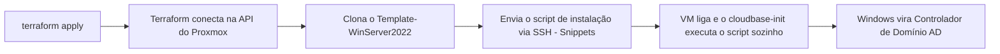

<div align="center">

### 🌐 Escolha o idioma / Choose your language / Elige tu idioma

[🇧🇷 **Português**](README.md) &nbsp;|&nbsp; [🇺🇸 English](README.en.md) &nbsp;|&nbsp; [🇪🇸 Español](README.es.md)

</div>

<div align="center">


# Active Directory automatizado no Proxmox com Terraform

</div>

Este projeto usa **Terraform** para criar automaticamente uma máquina virtual **Windows Server 2022** no **Proxmox VE**, clonada de um template já existente (`Template-WinServer2022`), e promovê-la a **Controlador de Domínio (Active Directory)** — tudo sozinho, sem precisar entrar no console da VM e digitar comandos manualmente.

Este guia foi escrito para quem **nunca configurou isso antes**. Siga os passos na ordem, do início ao fim.

---

## Índice

1. [Como funciona](#1-como-funciona)
2. [Pré-requisitos](#2-pré-requisitos)
3. [Passo a passo no Proxmox](#3-passo-a-passo-no-proxmox)
   - 3.1 [Instalar o Cloudbase-Init no template (OBRIGATÓRIO)](#31-instalar-o-cloudbase-init-no-template-obrigatório)
   - 3.2 [Criar o usuário e o API Token](#32-criar-o-usuário-e-o-api-token)
   - 3.3 [Entendendo as permissões (Roles/ACL) do token](#33-entendendo-as-permissões-rolesacl-do-token)
   - 3.4 [Habilitar "Snippets" no Storage](#34-habilitar-snippets-no-storage)
4. [Criar a chave SSH (no seu computador)](#4-criar-a-chave-ssh-no-seu-computador)
5. [Configurar o arquivo `terraform.tfvars`](#5-configurar-o-arquivo-terraformtfvars)
6. [Explicação de cada arquivo `.tf` (passo a passo do código)](#6-explicação-de-cada-arquivo-tf-passo-a-passo-do-código)
7. [Rodando o Terraform](#7-rodando-o-terraform)
8. [Verificando o resultado](#8-verificando-o-resultado)
9. [Destruindo tudo](#9-destruindo-tudo)
10. [Problemas comuns (Troubleshooting)](#10-problemas-comuns-troubleshooting)
11. [Segurança](#11-segurança)

---

## 1. Como funciona



- O Terraform fala com o Proxmox por **dois canais diferentes**:
  - **API (HTTPS)**: cria a VM, configura CPU, memória, rede, etc. Usa o **API Token**.
  - **SSH**: usado **só** para enviar (upload) o script de instalação do AD para dentro do Proxmox (chamado de *snippet*), porque o Proxmox não tem uma forma de fazer isso pela API. Usa a **chave SSH**.
- Quando a VM liga pela primeira vez, um programa chamado **cloudbase-init** (já instalado no template) lê esse script e executa automaticamente, sem precisar de WinRM, RDP ou qualquer intervenção manual.

---

## 2. Pré-requisitos

| Requisito | Onde conseguir |
|---|---|
| Terraform instalado no Windows | `winget install HashiCorp.Terraform` |
| Acesso administrativo ao Proxmox VE | Interface web do Proxmox (`https://<ip-do-proxmox>:8006`) |
| Template `Template-WinServer2022` já criado no Proxmox | Deve conter o **cloudbase-init** instalado (veja seção 3.1 — **sem isso, nada funciona**) |
| Cliente OpenSSH no Windows (para gerar chaves e testar SSH) | Já vem instalado no Windows 10/11 (`ssh`, `ssh-keygen`) |

---

## 3. Passo a passo no Proxmox

### 3.1 Instalar o Cloudbase-Init no template (OBRIGATÓRIO)

> ⚠️ **Este passo é obrigatório.** Sem o Cloudbase-Init instalado e configurado no template, a VM é criada normalmente, mas **nada do resto funciona**: a senha não é trocada, o IP estático não é aplicado e o script que instala o Active Directory nunca é executado. O Windows liga, mas fica "parado" esperando uma configuração que nunca chega.
>
> Como confirmar se falta: dentro de uma VM já criada, veja se a pasta `C:\Program Files\Cloudbase Solutions\Cloudbase-Init\` existe. Se não existir, siga os passos abaixo.

Para não correr risco de quebrar o template `Template-WinServer2022` que já está em uso, faça isso em um **clone temporário** — o original não é alterado.

**1. Clonar o template para uma VM temporária** (via SSH no Proxmox, ou pela interface web: botão direito no template → Clone → Full Clone):
```bash
qm clone 999 9000 --name temp-ws2022-cloudbaseinit-v2 --full
qm start 9000
```

**2. Acessar o console da VM temporária**
Na interface web do Proxmox: clique na VM `9000` → **Console**. Faça login com o usuário/senha administrativo atual do template.

**3. Baixar o instalador oficial do Cloudbase-Init** (dentro da VM, versão estável 64 bits):
```
https://www.cloudbase.it/downloads/CloudbaseInitSetup_Stable_x64.msi
```
> Se a VM não tiver acesso à internet, baixe no seu computador e copie o arquivo para dentro da VM (ex: anexando como CD-ROM em Storage → Upload, renomeando para `.iso`, ou por uma pasta de rede compartilhada).

**4. Rodar o instalador (assistente gráfico)**
Dê duplo clique no `.msi` baixado e siga o assistente:
- Pode deixar as opções padrão de configuração.
- Marque para o serviço rodar como **Local System**.
- **Não marque ainda "Run Sysprep and Shutdown" nesta tela** — antes disso, é preciso corrigir o `Unattend.xml` (passo 4.1 abaixo), senão toda VM clonada vai travar pedindo senha do Administrator na primeira inicialização.

#### 4.1 Corrigir o `Unattend.xml` (evita tela de senha do Administrator)

> ⚠️ **Problema comum:** o `Unattend.xml` padrão do Cloudbase-Init não define uma senha para a conta Administrator. Como o Windows não aceita senha em branco (política de complexidade), toda VM clonada do template trava no primeiro boot numa tela interativa pedindo para "criar uma senha" — quebrando a automação completa.

Abra o arquivo abaixo com um editor de texto (Bloco de Notas) dentro da VM temporária:
```
C:\Program Files\Cloudbase Solutions\Cloudbase-Init\conf\Unattend.xml
```

Dentro de `<settings pass="oobeSystem"> → <component name="Microsoft-Windows-Shell-Setup">`, adicione os blocos `<UserAccounts>` e `<AutoLogon>` logo depois do `</OOBE>`. Um exemplo pronto para copiar está incluído neste repositório em [`Unattend-corrigido.xml`](Unattend-corrigido.xml):

```xml
<settings pass="oobeSystem">
  <component name="Microsoft-Windows-Shell-Setup" ...>
    <OOBE>
      <HideEULAPage>true</HideEULAPage>
      <NetworkLocation>Work</NetworkLocation>
      <ProtectYourPC>1</ProtectYourPC>
      <SkipMachineOOBE>true</SkipMachineOOBE>
      <SkipUserOOBE>true</SkipUserOOBE>
    </OOBE>
    <UserAccounts>
      <AdministratorPassword>
        <Value>TempP@ss123</Value>
        <PlainText>true</PlainText>
      </AdministratorPassword>
    </UserAccounts>
    <AutoLogon>
      <Enabled>true</Enabled>
      <LogonCount>1</LogonCount>
      <Username>Administrator</Username>
      <Password>
        <Value>TempP@ss123</Value>
        <PlainText>true</PlainText>
      </Password>
    </AutoLogon>
  </component>
</settings>
```

> Essa senha `TempP@ss123` é apenas temporária/interna do template — o próprio script de provisionamento (`guest_script` em `ad_vars.tf`) troca a senha do Administrator automaticamente assim que o Cloudbase-Init roda o `user_data` na VM final. Não é necessário (nem recomendado) usar uma senha "real" aqui.

**5. Rodar o Sysprep manualmente**, apontando para o `Unattend.xml` já corrigido (abra um `cmd`/PowerShell **como Administrador** dentro da VM temporária):
```powershell
C:\Windows\System32\Sysprep\sysprep.exe /generalize /oobe /shutdown /unattend:"C:\Program Files\Cloudbase Solutions\Cloudbase-Init\conf\Unattend.xml"
```
- `/generalize` — remove informações específicas da máquina (SID, drivers), permitindo reutilizar a imagem.
- `/oobe` — na próxima inicialização, passa pela fase `oobeSystem` (onde o `UserAccounts`/`AutoLogon` corrigidos entram em ação).
- `/shutdown` — desliga a VM sozinha ao terminar (sinal de sucesso).
- `/unattend:"..."` — força o uso do arquivo corrigido.
- Não interrompa o processo — pode levar alguns minutos e a VM reinicia sozinha antes de desligar de vez.
- Se aparecer erro de "número máximo de sysprep atingido" (limite de ~3 generalizações do Windows), é preciso clonar novamente a partir de uma imagem "fresca" (não generalizada).

**6. Converter a VM em um novo template**, quando o status estiver **Stopped**:
```bash
qm template 9000
```

**7. Apontar o Terraform para o novo template**, no `terraform.tfvars`:
```hcl
template_name = "temp-ws2022-cloudbaseinit-v2"
```

> Depois desse processo, todo novo clone feito a partir desse template já nasce com o Cloudbase-Init generalizado (e sem a tela de senha travando o boot), pronto para executar o `user_data` automaticamente no primeiro boot — que é exatamente o que o `ad.tf` deste projeto espera.

### 3.2 Criar o usuário e o API Token

O Terraform precisa de credenciais para conversar com a API do Proxmox **sem** usar login/senha interativo. É para isso que existe o **API Token**: uma chave de acesso vinculada a um usuário, que pode ser revogada a qualquer momento sem trocar a senha da conta.

#### Opção A — Simples (usada por padrão neste projeto)

Ideal para laboratório/homelab, onde você mesmo é o único administrador.

1. Acesse a interface web do Proxmox: `https://<ip-do-proxmox>:8006`
2. Vá em **Datacenter** → **Permissions** → **API Tokens**
3. Clique em **Add**
4. Preencha:
   - **User**: `root@pam` (o superusuário do Proxmox — já tem acesso total a tudo)
   - **Token ID**: `terraform` (qualquer nome que te ajude a identificar depois)
   - ⚠️ **Desmarque a opção "Privilege Separation"** — explicado em detalhes na seção 3.3 abaixo. Se deixar marcada, o Terraform não consegue configurar alguns recursos de hardware da VM (erro comum: `only root can set 'usb0' config for real devices`).
5. Clique em **Add** e **copie o "Secret" imediatamente** — ele só aparece uma vez! Se perder, é preciso apagar o token e criar outro.
6. O token final tem este formato, que você vai usar depois no `terraform.tfvars`:
   ```
   root@pam!terraform=xxxxxxxx-xxxx-xxxx-xxxx-xxxxxxxxxxxx
   ```
   - Antes do `!` → usuário (`root@pam`)
   - Entre `!` e `=` → nome do token (`terraform`)
   - Depois do `=` → o "Secret" (segredo), equivalente a uma senha

#### Opção B — Recomendada para produção (usuário dedicado + permissões mínimas)

Em vez de usar `root@pam` (que tem acesso irrestrito a **tudo** no cluster), crie um usuário só para o Terraform e dê a ele **apenas** as permissões necessárias. Assim, se o token vazar algum dia, o estrago é limitado.

1. **Datacenter → Permissions → Users → Add**: crie `terraform@pve` com uma senha qualquer (ela não será usada, só o token).
2. **Datacenter → Permissions → Roles → Create**: crie uma role chamada `TerraformProvisioner` com estes privilégios:
   `VM.Allocate`, `VM.Clone`, `VM.Config.CDROM`, `VM.Config.CPU`, `VM.Config.Disk`, `VM.Config.Memory`, `VM.Config.Network`, `VM.Config.Options`, `VM.Monitor`, `VM.Audit`, `VM.PowerMgmt`, `Datastore.AllocateSpace`, `Datastore.AllocateTemplate`, `Datastore.Audit`, `Sys.Audit`, `Sys.Modify`, `Pool.Allocate`
3. **Datacenter → Permissions → Add → User Permission**: vincule `terraform@pve` (ou `terraform@pve!terraform`, se marcou Privilege Separation) ao path `/` (todo o cluster, ou restrinja a um pool/nó específico) com a role `TerraformProvisioner`.
4. **Datacenter → Permissions → API Tokens → Add**: crie o token para `terraform@pve` (mantendo Privilege Separation **marcada**, já que agora o usuário tem só o necessário).

### 3.3 Entendendo as permissões (Roles/ACL) do token

Este é o ponto que mais confunde iniciantes, então vamos com calma:

- No Proxmox, permissões funcionam em três camadas: **Usuário** → **Role** (conjunto de privilégios) → **ACL** (o vínculo entre usuário + role + "caminho" de recursos, tipo `/` ou `/vms/100`).
- Um **API Token** normalmente **herda** as permissões do usuário dono dele — **a menos que** a opção **"Privilege Separation"** esteja marcada.
- **Privilege Separation marcada** = o token passa a ter suas **próprias** permissões, separadas do usuário — você precisa criar uma ACL específica para `usuario@realm!tokenid` (e não só para `usuario@realm`). É mais seguro, mas dá mais trabalho.
- **Privilege Separation desmarcada** = o token **copia** as permissões do usuário automaticamente. Mais simples, mas se o token vazar, o atacante tem exatamente o que o usuário tem.
- Por isso, com `root@pam` (Opção A), a recomendação é **desmarcar** Privilege Separation, já que o objetivo é simplicidade em ambiente de laboratório — o próprio `root` já tem tudo liberado de qualquer forma.
- Com um usuário dedicado com permissões mínimas (Opção B), faz sentido **manter marcada**, criando a ACL explicitamente para o token — reforçando o princípio de menor privilégio.

### 3.4 Habilitar "Snippets" no Storage

Por padrão, o Proxmox **não permite** o upload de scripts (snippets) em nenhum storage. Precisamos habilitar isso manualmente, **uma única vez**:

1. Vá em **Datacenter** → **Storage**
2. Clique no storage que você usa (geralmente chamado **local**) → **Edit**
3. No campo **Content**, marque a opção **Snippets**
4. Clique em **OK**

Se você usa um storage diferente de `local`, anote o nome dele — você vai precisar informar no `terraform.tfvars` (variável `snippets_datastore_id`).

---

## 4. Criar a chave SSH (no seu computador)

O SSH é necessário só para o Terraform conseguir enviar o script de instalação do AD para o Proxmox. Em vez de usar senha toda vez, criamos uma **chave** — é mais seguro e não trava o `apply` pedindo senha no meio do processo.

Abra o **PowerShell** e rode, um comando de cada vez:

**1. Gerar o par de chaves** (privada + pública):
```powershell
ssh-keygen -t ed25519 -f "$env:USERPROFILE\.ssh\proxmox_terraform" -N '""'
```
> Isso cria dois arquivos em `C:\Users\SEU_USUARIO\.ssh\`:
> - `proxmox_terraform` → chave **privada** (nunca compartilhe/versione este arquivo)
> - `proxmox_terraform.pub` → chave **pública** (esta pode ser compartilhada)

**2. Copiar a chave pública para o Proxmox**, autorizando o acesso:
```powershell
type "$env:USERPROFILE\.ssh\proxmox_terraform.pub" | ssh root@192.168.200.107 "mkdir -p ~/.ssh && cat >> ~/.ssh/authorized_keys && chmod 600 ~/.ssh/authorized_keys"
```
> Troque `192.168.200.107` pelo IP real do seu Proxmox. Esse comando vai pedir a senha do `root` do Proxmox **uma última vez** — depois disso não pede mais.

**3. Testar se funcionou** (não deve pedir senha):
```powershell
ssh -i "$env:USERPROFILE\.ssh\proxmox_terraform" root@192.168.200.107 "echo ok"
```
Se aparecer `ok`, está tudo certo. Se pedir senha, revise o passo 2.

---

## 5. Configurar o arquivo `terraform.tfvars`

Este é o **único arquivo que você precisa editar** com os seus dados reais. Ele nunca é enviado ao Git (está no `.gitignore`), pois contém senhas e tokens.

1. Copie o arquivo de exemplo:
   ```powershell
   Copy-Item terraform.tfvars.example terraform.tfvars
   ```
2. Abra `terraform.tfvars` e preencha cada campo:

```hcl
# --- Conexão com o Proxmox ---
proxmox_endpoint  = "https://192.168.200.107:8006/"   # IP/URL do seu Proxmox
proxmox_api_token = "root@pam!terraform=xxxx..."       # Token criado no passo 3.2
proxmox_insecure  = true                                # true = ignora certificado autoassinado

# --- VM ---
target_node   = "proxmox"                # Nome do node no Proxmox (aparece no menu à esquerda)
template_name = "Template-WinServer2022" # Nome exato do template
vm_id         = 5010                     # ID numérico livre para a nova VM
vm_name       = "ad-dc01"                # Nome da VM

# --- Rede ---
bridge_network    = "vmbr0"              # Bridge de rede do Proxmox
bridge_cidr_range = "192.168.200.0/24"   # Rede onde a VM vai receber IP fixo
ad_network_host   = 10                   # Último número do IP (aqui = .10)

# --- SSH (necessário só para enviar o script via Snippets) ---
ssh_username         = "root"
ssh_agent            = false
ssh_private_key_path = "C:/Users/SEU_USUARIO/.ssh/proxmox_terraform"   # chave criada no passo 4

# --- Domínio do Active Directory (ficam no ad_vars.tf, veja seção 6) ---
domain_name                      = "aromaforhealth.corp"
dc_name                          = "ntdc01"
domain_netbios_name              = "aromaforhealth"
vm_admin_username                = "Administrator"
domain_admin_password            = "SuaSenhaForte123@"
safe_mode_administrator_password = "SuaSenhaForte123@"
```

> ⚠️ Use `vm_admin_username = "Administrator"` para que o Terraform **redefina a senha da conta Administrator já existente** no template, em vez de criar um usuário novo.

---

## 6. Explicação de cada arquivo `.tf` (passo a passo do código)

| Arquivo | O que faz |
|---|---|
| **`provider.tf`** | Diz ao Terraform como se conectar ao Proxmox: endereço (`endpoint`), token de API e as credenciais SSH (usadas só para o upload do script de snippets). |
| **`variables.tf`** | Declaração de todas as variáveis de conexão, rede e SSH — são os "campos em branco" que você preenche no `terraform.tfvars`. |
| **`ad_vars.tf`** | Variáveis específicas do domínio (nome do domínio, senhas, NetBIOS) e o script PowerShell que promove o Windows a Controlador de Domínio. Esse script é montado dentro do bloco `locals` e vira o conteúdo executado no primeiro boot da VM. |
| **`ad.tf`** | O "coração" do projeto: procura o template pelo nome, envia o script como *snippet* para o Proxmox, e cria a VM (clone do template) já apontando para esse script via `user_data_file_id`. |
| **`outputs.tf`** | Mostra, depois do `apply`, o nome, ID e IP da VM criada. |
| **`terraform.tfvars`** | Seus valores reais (senhas, IP, token). **Nunca comitar no Git.** |
| **`terraform.tfvars.example`** | Modelo/exemplo do `terraform.tfvars`, sem dados reais — serve de referência. |

### 6.1 `provider.tf` — como o Terraform se conecta ao Proxmox

```hcl
terraform {
  required_providers {
    proxmox = {
      source  = "bpg/proxmox"
      version = "0.66.0"
    }
    local = {
      source  = "hashicorp/local"
      version = "~> 2.5"
    }
  }
}

provider "proxmox" {
  endpoint  = var.proxmox_endpoint
  api_token = var.proxmox_api_token
  insecure  = var.proxmox_insecure

  ssh {
    username    = var.ssh_username
    agent       = var.ssh_agent
    password    = var.ssh_password == "" ? null : var.ssh_password
    private_key = var.ssh_private_key_path == "" ? null : file(var.ssh_private_key_path)
  }
}
```

Linha por linha, em português simples:

- `required_providers`: diz ao Terraform quais "plugins" baixar. `bpg/proxmox` é o provider (o "tradutor" entre o código Terraform e a API do Proxmox). `hashicorp/local` só é usado para salvar uma cópia do script gerado em disco (fins de depuração).
- `provider "proxmox" { ... }`: aqui configuramos a conexão em si.
  - `endpoint`: a URL da API do Proxmox (ex: `https://192.168.200.107:8006/`).
  - `api_token`: o token criado na seção 3.2 — é usado para **toda** a criação/gerenciamento da VM via API.
  - `insecure`: quando `true`, ignora a validação do certificado TLS (necessário porque o Proxmox usa certificado autoassinado por padrão).
  - Bloco `ssh { }`: usado **só** para enviar o script de instalação (snippet), já que a API do Proxmox não tem endpoint para isso. Você pode autenticar de 3 formas (escolha uma, deixando as outras vazias/`false`):
    - `agent = true` → usa o ssh-agent do Windows (chave já carregada em memória).
    - `private_key` → aponta para o arquivo de chave privada (o que fizemos no passo 4). A função `file(...)` lê o conteúdo do arquivo em disco.
    - `password` → senha SSH direta (menos recomendado, evite em produção).

### 6.2 `variables.tf` — os "campos em branco" do projeto

Cada bloco `variable "nome" { ... }` declara uma variável de entrada. Exemplo:

```hcl
variable "proxmox_api_token" {
  type        = string
  description = "API Token do Proxmox no formato user@realm!tokenid=uuid"
  sensitive   = true
}
```

- `type = string`: o Terraform valida que só aceita texto nesse campo (evita erro de digitação, tipo passar número onde deveria ser texto).
- `description`: aparece quando você roda `terraform plan` sem preencher a variável — o Terraform pergunta e mostra essa descrição de ajuda.
- `sensitive = true`: instrui o Terraform a **esconder o valor nos logs e no output do plan/apply** — importante para tokens e senhas, para não aparecerem "no claro" no terminal ou em CI/CD.
- Variáveis com `default = "..."` são opcionais (se você não definir no `terraform.tfvars`, usa o valor padrão). Variáveis **sem** `default` são obrigatórias.

### 6.3 `ad_vars.tf` — o "cérebro" do provisionamento do Active Directory

Esse arquivo tem duas partes: as variáveis do domínio (nomes, senhas) e um bloco `locals` que monta o **script PowerShell** que vai rodar dentro da VM Windows no primeiro boot.

```hcl
locals {
  cmd01 = "Install-WindowsFeature AD-Domain-Services -IncludeAllSubFeature -IncludeManagementTools"
  cmd02 = "Install-WindowsFeature DNS -IncludeAllSubFeature -IncludeManagementTools"
  cmd03 = "Import-Module ADDSDeployment, DnsServer"
  cmd04 = "Install-ADDSForest -DomainName '${var.domain_name}' ..."
  powershell = "${local.cmd01}; ${local.cmd02}; ${local.cmd03}; ${local.cmd04}"
  ...
}
```

- `cmd01`/`cmd02`: instalam as **roles do Windows** necessárias — `AD-Domain-Services` (Active Directory Domain Services) e `DNS` (obrigatório para um domínio funcionar corretamente).
- `cmd03`: carrega os módulos PowerShell que serão usados no próximo comando.
- `cmd04`: o comando que efetivamente **cria a floresta/domínio** (`Install-ADDSForest`). Repare que `${var.domain_name}` é **interpolação** — o Terraform substitui pelo valor real que você definiu no `terraform.tfvars` antes de gravar o script.
- As aspas simples (`'${var.domain_name}'`) dentro do PowerShell servem para o valor funcionar mesmo se tiver caracteres especiais como `&`, `%` ou espaços (comum em senhas).

Depois, o bloco `guest_script` monta o script **completo** que a VM vai executar:

```hcl
guest_script = <<-EOT
  net user "${var.vm_admin_username}" "${var.domain_admin_password}"
  net user Admin /delete

  $adapter = Get-NetAdapter | Where-Object { $_.Status -eq 'Up' } | Select-Object -First 1
  if ($adapter) {
    New-NetIPAddress -InterfaceIndex $adapter.ifIndex -IPAddress "${cidrhost(var.bridge_cidr_range, var.ad_network_host)}" -PrefixLength 24 -DefaultGateway "${cidrhost(var.bridge_cidr_range, 1)}" -ErrorAction SilentlyContinue
    Set-DnsClientServerAddress -InterfaceIndex $adapter.ifIndex -ServerAddresses ("127.0.0.1","${cidrhost(var.bridge_cidr_range, 1)}")
  }

  ${local.cmd01}
  ${local.cmd02}
  ${local.cmd03}
  ${local.cmd04}
EOT
```

Passo a passo do que esse script faz, na ordem:

1. `net user ... "senha"` — redefine a senha da conta Administrator (ou do usuário informado) com a senha real que você definiu — a VM sai do template com uma senha só temporária (lembra do `TempP@ss123`?).
2. `net user Admin /delete` — remove uma conta extra chamada "Admin" que o Cloudbase-Init cria por padrão com senha aleatória (não é usada por este projeto, então é removida por segurança).
3. `Get-NetAdapter ...` — descobre qual placa de rede está ativa (importante porque o nome pode variar entre VMs).
4. `New-NetIPAddress` / `Set-DnsClientServerAddress` — configura um **IP fixo** (usando a função `cidrhost()` do Terraform para calcular o IP a partir do CIDR + host) e aponta o DNS da própria VM para si mesma (`127.0.0.1`, necessário depois que ela virar DC) e para o gateway como fallback.
5. `cmd01`/`cmd02`/`cmd03`/`cmd04` — instala as roles do AD/DNS e, por fim, promove o servidor a Controlador de Domínio.

Por fim:

```hcl
cloudbase_userdata = <<-EOT
  #ps1_sysnative
  ${local.guest_script}
EOT
```

- A primeira linha `#ps1_sysnative` é uma "assinatura mágica" que o Cloudbase-Init reconhece: ela diz "execute este arquivo como um script PowerShell (64 bits)". Sem essa linha, o Cloudbase-Init ignora o arquivo.

### 6.4 `ad.tf` — onde a VM realmente é criada

```hcl
data "proxmox_virtual_environment_vms" "ad_template" {
  filter {
    name   = "name"
    values = [var.template_name]
  }
  filter {
    name   = "template"
    values = [true]
  }
}
```
- Um bloco `data` **não cria nada** — ele só **consulta** o Proxmox para descobrir o ID interno do template pelo nome (`var.template_name`), garantindo que estamos clonando o template certo mesmo que o ID numérico mude.

```hcl
resource "proxmox_virtual_environment_file" "ad_userdata" {
  content_type = "snippets"
  datastore_id = var.snippets_datastore_id
  node_name    = var.target_node

  source_raw {
    data      = local.cloudbase_userdata
    file_name = "ad-userdata-${var.vm_name}.ps1"
  }
}
```
- Esse `resource` **envia o script montado na seção 6.3 para o Proxmox**, como um arquivo do tipo "snippet" (é por isso que precisamos habilitar Snippets no storage — seção 3.4 — e ter SSH configurado, já que é assim que o provider faz esse upload internamente).

```hcl
resource "proxmox_virtual_environment_vm" "ad" {
  node_name = var.target_node
  vm_id     = var.vm_id
  name      = var.vm_name
  tags      = ["ad", "dc"]

  clone {
    vm_id = data.proxmox_virtual_environment_vms.ad_template.vms[0].vm_id
    full  = true
  }

  cpu {
    cores   = var.ad_cores
    sockets = var.ad_sockets
    type    = "host"
  }

  memory {
    dedicated = var.ad_memory
  }

  network_device {
    bridge = var.bridge_network
    model  = "virtio"
  }

  initialization {
    user_data_file_id = proxmox_virtual_environment_file.ad_userdata.id

    ip_config {
      ipv4 {
        address = "${cidrhost(var.bridge_cidr_range, var.ad_network_host)}/24"
        gateway = cidrhost(var.bridge_cidr_range, 1)
      }
    }
  }
}
```
- `clone { vm_id = ..., full = true }`: clona o template encontrado pelo `data` acima. `full = true` significa **Full Clone** (cópia completa e independente do disco, em vez de um Linked Clone que depende do template original continuar existindo).
- `cpu` / `memory` / `network_device`: hardware da VM — todos vêm de variáveis, então dá pra ajustar sem tocar no código.
- `initialization.user_data_file_id`: aqui está a "mágica" — em vez de configurar usuário/senha manualmente (`user_account`, abordagem antiga baseada em cloud-init genérico), apontamos para o **ID do snippet** que acabamos de enviar. É esse campo que faz o Cloudbase-Init, no primeiro boot, ler e executar o script da seção 6.3 sozinho.
- `ip_config.ipv4`: configura o IP fixo diretamente pela integração do Proxmox com o cloudbase-init (complementado pelo próprio script, que também define IP/DNS via PowerShell, por redundância).

### 6.5 `outputs.tf` — o que aparece na tela no final

```hcl
output "ad_vm_name" {
  value = proxmox_virtual_environment_vm.ad.name
}
output "ad_vm_id" {
  value = proxmox_virtual_environment_vm.ad.vm_id
}
output "ad_ip_address" {
  value = cidrhost(var.bridge_cidr_range, var.ad_network_host)
}
```
- Cada `output` expõe um valor no terminal depois do `terraform apply`, para você confirmar rapidamente o nome, ID e IP da VM criada sem precisar abrir a interface do Proxmox.

---

## 7. Rodando o Terraform

Abra o PowerShell na pasta do projeto:

```powershell
cd "D:\Terraform Proxmox\AD"
```

**1. Inicializar** (baixa os providers do Proxmox/local — só precisa rodar uma vez ou quando mudar de versão):
```powershell
terraform init
```

**2. Ver o que será criado** (não altera nada, é só uma prévia):
```powershell
terraform plan
```

**3. Aplicar de verdade** (cria a VM e o AD):
```powershell
terraform apply -auto-approve
```

Aguarde alguns minutos — a VM precisa ligar, o cloudbase-init executa o script, o Windows instala os papéis de AD/DNS e reinicia sozinho para virar Controlador de Domínio.

---

## 8. Verificando o resultado

Depois do `apply` terminar sem erros, o Terraform mostra os outputs:
```
ad_vm_name    = "ad-dc01"
ad_vm_id      = 5010
ad_ip_address = "192.168.200.10"
```

Para confirmar que o AD subiu:
1. Acesse o console da VM pela interface web do Proxmox, **ou**
2. Espere alguns minutos após o boot e teste via PowerShell (rede):
   ```powershell
   Test-NetConnection -ComputerName 192.168.200.10 -Port 389   # porta do LDAP
   ```
3. Login na VM: usuário `Administrator`, senha definida em `domain_admin_password` no seu `terraform.tfvars`.

---

## 9. Destruindo tudo

Se quiser apagar a VM e recomeçar do zero:
```powershell
terraform destroy -auto-approve
```

---

## 10. Problemas comuns (Troubleshooting)

| Erro | Causa | Solução |
|---|---|---|
| `only root can set 'usb0' config for real devices` | O token de API está com "Privilege Separation" habilitado | Recrie o token desmarcando essa opção (seção 3.2) |
| `the datastore 'local' does not support content type 'snippets'` | Snippets não habilitado no storage | Habilite em Datacenter → Storage → Content (seção 3.4) |
| A senha não muda, o IP estático não é aplicado e o AD nunca é instalado | O template não tem o Cloudbase-Init instalado | Siga a seção 3.1 (obrigatório) para instalar o Cloudbase-Init e gerar um novo template |
| A VM trava no console pedindo para "criar uma senha" do Administrator logo no primeiro boot | O `Unattend.xml` do Cloudbase-Init não define senha para a conta Administrator (senha em branco não é aceita pelo Windows) | Siga a seção 3.1 (item 4.1) para adicionar `<UserAccounts>`/`<AutoLogon>` no `Unattend.xml` e rodar o Sysprep novamente |
| Existe uma conta local extra chamada "Admin" com senha desconhecida | O `CreateUserPlugin` do Cloudbase-Init cria essa conta por padrão, independente do `user_data` | Pode ser ignorada (não é usada por este projeto) ou removida manualmente com `net user Admin /delete` |
| `failed to open SSH client: unable to authenticate` | Chave SSH não autorizada no Proxmox, ou caminho errado no `ssh_private_key_path` | Repita a seção 4 e confirme o caminho no `terraform.tfvars` |
| A senha do Windows não bate após criar a VM | `vm_admin_username` não é exatamente `Administrator` | Use `vm_admin_username = "Administrator"` para redefinir a conta já existente |
| `terraform apply` trava por vários minutos e falha por timeout de conexão | Resquício de uma versão antiga usando WinRM | Este projeto já não usa WinRM — confirme que está usando a versão atual do `ad.tf` (com `user_data_file_id`) |
| Permissão negada mesmo com o token criado (Opção B) | ACL não foi vinculada ao token (`usuario@realm!tokenid`), e não apenas ao usuário | Revise a seção 3.3 — com Privilege Separation marcada, a ACL precisa ser dada explicitamente ao token |

---

## 11. Segurança

- **Nunca** commite `terraform.tfvars`, `.env`, `terraform.tfstate` ou a chave privada SSH (`proxmox_terraform`) em repositórios Git — todos já estão no `.gitignore`.
- O `terraform.tfstate` guarda dados sensíveis (inclusive senhas) em texto simples — trate-o como um segredo.
- Prefira `private_key` (chave SSH) a `password` sempre que possível.
- Troque as senhas padrão de exemplo (`domain_admin_password`, `safe_mode_administrator_password`) por senhas fortes antes de usar em produção.
- Em ambientes compartilhados/produção, prefira a **Opção B** da seção 3.2 (usuário dedicado + permissões mínimas) em vez de usar o token de `root@pam`.

---

<div align="center">

**Autor:** Marcelo Goncalves

[🇧🇷 Português](README.md) &nbsp;|&nbsp; [🇺🇸 English](README.en.md) &nbsp;|&nbsp; [🇪🇸 Español](README.es.md)

</div>
