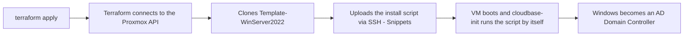

<div align="center">

### 🌐 Choose your language / Escolha o idioma / Elige tu idioma

[�🇸 **English**](README.md) &nbsp;|&nbsp; [🇧🇷 Português](README.pt.md) &nbsp;|&nbsp; [🇪🇸 Español](README.es.md)

</div>

<div align="center">


# Automated Active Directory on Proxmox with Terraform

</div>

This project uses **Terraform** to automatically create a **Windows Server 2022** virtual machine on **Proxmox VE**, cloned from an existing template (`Template-WinServer2022`), and promote it to a **Domain Controller (Active Directory)** — all by itself, with no need to open the VM console and type commands manually.

This guide is written for people who have **never configured this before**. Follow the steps in order, from start to finish.

---

## Table of Contents

1. [How it works](#1-how-it-works)
2. [Prerequisites](#2-prerequisites)
3. [Step-by-step on Proxmox](#3-step-by-step-on-proxmox)
   - 3.1 [Install Cloudbase-Init on the template (MANDATORY)](#31-install-cloudbase-init-on-the-template-mandatory)
   - 3.2 [Create the user and the API Token](#32-create-the-user-and-the-api-token)
   - 3.3 [Understanding token permissions (Roles/ACL)](#33-understanding-token-permissions-rolesacl)
   - 3.4 [Enable "Snippets" on the storage](#34-enable-snippets-on-the-storage)
4. [Create the SSH key (on your computer)](#4-create-the-ssh-key-on-your-computer)
5. [Configure the `terraform.tfvars` file](#5-configure-the-terraformtfvars-file)
6. [Explanation of each `.tf` file (code walkthrough)](#6-explanation-of-each-tf-file-code-walkthrough)
7. [Running Terraform](#7-running-terraform)
8. [Checking the result](#8-checking-the-result)
9. [Destroying everything](#9-destroying-everything)
10. [Common issues (Troubleshooting)](#10-common-issues-troubleshooting)
11. [Security](#11-security)

---

## 1. How it works



- Terraform talks to Proxmox through **two different channels**:
  - **API (HTTPS)**: creates the VM, configures CPU, memory, network, etc. Uses the **API Token**.
  - **SSH**: used **only** to upload the AD installation script into Proxmox (called a *snippet*), because Proxmox has no API endpoint to do this. Uses the **SSH key**.
- The first time the VM boots, a program called **cloudbase-init** (already installed on the template) reads that script and runs it automatically — no WinRM, RDP, or manual intervention needed.

---

## 2. Prerequisites

| Requirement | Where to get it |
|---|---|
| Terraform installed on Windows | `winget install HashiCorp.Terraform` |
| Administrative access to Proxmox VE | Proxmox web UI (`https://<proxmox-ip>:8006`) |
| `Template-WinServer2022` template already created on Proxmox | Must have **cloudbase-init** installed (see section 3.1 — **without it, nothing works**) |
| OpenSSH client on Windows (to generate keys and test SSH) | Already bundled with Windows 10/11 (`ssh`, `ssh-keygen`) |

---

## 3. Step-by-step on Proxmox

### 3.1 Install Cloudbase-Init on the template (MANDATORY)

> ⚠️ **This step is mandatory.** Without Cloudbase-Init installed and configured on the template, the VM is created normally, but **nothing else works**: the password is never changed, the static IP is never applied, and the script that installs Active Directory never runs. Windows boots but stays "stuck" waiting for a configuration that never arrives.
>
> How to check if it's missing: inside an already-created VM, check whether `C:\Program Files\Cloudbase Solutions\Cloudbase-Init\` exists. If it doesn't, follow the steps below.

To avoid the risk of breaking the `Template-WinServer2022` template that's already in use, do this on a **temporary clone** — the original stays untouched.

**1. Clone the template into a temporary VM** (via SSH on Proxmox, or through the web UI: right-click the template → Clone → Full Clone):
```bash
qm clone 999 9000 --name temp-ws2022-cloudbaseinit-v2 --full
qm start 9000
```

**2. Open the temporary VM's console**
In the Proxmox web UI: click VM `9000` → **Console**. Log in with the template's current administrative user/password.

**3. Download the official Cloudbase-Init installer** (inside the VM, stable 64-bit version):
```
https://www.cloudbase.it/downloads/CloudbaseInitSetup_Stable_x64.msi
```
> If the VM has no internet access, download it on your computer and copy it into the VM (e.g. attach it as a CD-ROM via Storage → Upload, renaming it to `.iso`, or through a shared network folder).

**4. Run the installer (graphical wizard)**
Double-click the downloaded `.msi` and follow the wizard:
- Default configuration options are fine.
- Set the service to run as **Local System**.
- **Do not check "Run Sysprep and Shutdown" on this screen yet** — before doing that, you need to fix the `Unattend.xml` (step 4.1 below), otherwise every cloned VM will get stuck asking for the Administrator password on first boot.

#### 4.1 Fix `Unattend.xml` (avoids the Administrator password screen)

> ⚠️ **Common problem:** Cloudbase-Init's default `Unattend.xml` does not set a password for the Administrator account. Since Windows won't accept a blank password (complexity policy), every VM cloned from the template gets stuck on first boot at an interactive screen asking to "create a password" — breaking full automation.

Open the file below with a text editor (Notepad) inside the temporary VM:
```
C:\Program Files\Cloudbase Solutions\Cloudbase-Init\conf\Unattend.xml
```

Inside `<settings pass="oobeSystem"> → <component name="Microsoft-Windows-Shell-Setup">`, add the `<UserAccounts>` and `<AutoLogon>` blocks right after `</OOBE>`. A ready-to-copy example is included in this repository at [`Unattend-corrigido.xml`](Unattend-corrigido.xml):

```xml
<settings pass="oobeSystem">
  <component name="Microsoft-Windows-Shell-Setup" ...>
    <OOBE>
      <HideEULAPage>true</HideEULAPage>
      <NetworkLocation>Work</NetworkLocation>
      <ProtectYourPC>1</ProtectYourPC>
      <SkipMachineOOBE>true</SkipMachineOOBE>
      <SkipUserOOBE>true</SkipUserOOBE>
    </OOBE>
    <UserAccounts>
      <AdministratorPassword>
        <Value>TempP@ss123</Value>
        <PlainText>true</PlainText>
      </AdministratorPassword>
    </UserAccounts>
    <AutoLogon>
      <Enabled>true</Enabled>
      <LogonCount>1</LogonCount>
      <Username>Administrator</Username>
      <Password>
        <Value>TempP@ss123</Value>
        <PlainText>true</PlainText>
      </Password>
    </AutoLogon>
  </component>
</settings>
```

> That `TempP@ss123` password is just a temporary/internal placeholder for the template — the provisioning script itself (`guest_script` in `ad_vars.tf`) automatically changes the Administrator password once Cloudbase-Init runs `user_data` on the final VM. There's no need (and it's not recommended) to use a "real" password here.

**5. Run Sysprep manually**, pointing to the already-fixed `Unattend.xml` (open `cmd`/PowerShell **as Administrator** inside the temporary VM):
```powershell
C:\Windows\System32\Sysprep\sysprep.exe /generalize /oobe /shutdown /unattend:"C:\Program Files\Cloudbase Solutions\Cloudbase-Init\conf\Unattend.xml"
```
- `/generalize` — removes machine-specific information (SID, drivers), allowing the image to be reused.
- `/oobe` — on next boot, goes through the `oobeSystem` pass (where the fixed `UserAccounts`/`AutoLogon` kick in).
- `/shutdown` — shuts the VM down by itself when finished (success signal).
- `/unattend:"..."` — forces the use of the fixed file.
- Don't interrupt the process — it can take a few minutes, and the VM reboots on its own before shutting down for good.
- If you get a "sysprep limit reached" error (Windows allows ~3 generalizations), you need to clone again from a "fresh" (non-generalized) image.

**6. Convert the VM into a new template**, once its status is **Stopped**:
```bash
qm template 9000
```

**7. Point Terraform to the new template**, in `terraform.tfvars`:
```hcl
template_name = "temp-ws2022-cloudbaseinit-v2"
```

> After this process, every new clone made from this template is already generalized with Cloudbase-Init (and without the password screen blocking the boot), ready to automatically run the `user_data` on first boot — which is exactly what this project's `ad.tf` expects.

### 3.2 Create the user and the API Token

Terraform needs credentials to talk to the Proxmox API **without** using interactive login/password. That's what the **API Token** is for: an access key tied to a user, which can be revoked at any time without changing the account's password.

#### Option A — Simple (used by default in this project)

Ideal for a lab/homelab, where you're the only administrator.

1. Open the Proxmox web UI: `https://<proxmox-ip>:8006`
2. Go to **Datacenter** → **Permissions** → **API Tokens**
3. Click **Add**
4. Fill in:
   - **User**: `root@pam` (Proxmox's superuser — already has full access to everything)
   - **Token ID**: `terraform` (any name that helps you identify it later)
   - ⚠️ **Uncheck "Privilege Separation"** — explained in detail in section 3.3 below. If left checked, Terraform can't configure some VM hardware resources (common error: `only root can set 'usb0' config for real devices`).
5. Click **Add** and **copy the "Secret" immediately** — it's only shown once! If you lose it, you'll need to delete the token and create a new one.
6. The final token looks like this, and you'll use it later in `terraform.tfvars`:
   ```
   root@pam!terraform=xxxxxxxx-xxxx-xxxx-xxxx-xxxxxxxxxxxx
   ```
   - Before the `!` → the user (`root@pam`)
   - Between `!` and `=` → the token name (`terraform`)
   - After the `=` → the "Secret", equivalent to a password

#### Option B — Recommended for production (dedicated user + minimal permissions)

Instead of using `root@pam` (which has unrestricted access to **everything** in the cluster), create a user just for Terraform and grant it **only** the permissions it needs. That way, if the token ever leaks, the damage is limited.

1. **Datacenter → Permissions → Users → Add**: create `terraform@pve` with any password (it won't actually be used, only the token).
2. **Datacenter → Permissions → Roles → Create**: create a role called `TerraformProvisioner` with these privileges:
   `VM.Allocate`, `VM.Clone`, `VM.Config.CDROM`, `VM.Config.CPU`, `VM.Config.Disk`, `VM.Config.Memory`, `VM.Config.Network`, `VM.Config.Options`, `VM.Monitor`, `VM.Audit`, `VM.PowerMgmt`, `Datastore.AllocateSpace`, `Datastore.AllocateTemplate`, `Datastore.Audit`, `Sys.Audit`, `Sys.Modify`, `Pool.Allocate`
3. **Datacenter → Permissions → Add → User Permission**: link `terraform@pve` (or `terraform@pve!terraform`, if Privilege Separation is checked) to the path `/` (the whole cluster, or restrict it to a specific pool/node) with the `TerraformProvisioner` role.
4. **Datacenter → Permissions → API Tokens → Add**: create the token for `terraform@pve` (keeping Privilege Separation **checked**, since the user now only has what's necessary).

### 3.3 Understanding token permissions (Roles/ACL)

This is the point that confuses beginners the most, so let's go slowly:

- In Proxmox, permissions work in three layers: **User** → **Role** (set of privileges) → **ACL** (the link between user + role + resource "path", like `/` or `/vms/100`).
- An **API Token** normally **inherits** the permissions of the user who owns it — **unless** the **"Privilege Separation"** option is checked.
- **Privilege Separation checked** = the token gets its **own** permissions, separate from the user — you need to create a specific ACL for `user@realm!tokenid` (not just for `user@realm`). More secure, but more work.
- **Privilege Separation unchecked** = the token **automatically copies** the user's permissions. Simpler, but if the token leaks, the attacker gets exactly what the user has.
- That's why, with `root@pam` (Option A), the recommendation is to **uncheck** Privilege Separation, since the goal is simplicity in a lab environment — `root` already has everything unlocked anyway.
- With a dedicated user with minimal permissions (Option B), it makes sense to **keep it checked**, explicitly creating the ACL for the token — reinforcing the principle of least privilege.

### 3.4 Enable "Snippets" on the storage

By default, Proxmox **does not allow** uploading scripts (snippets) to any storage. We need to enable this manually, **just once**:

1. Go to **Datacenter** → **Storage**
2. Click the storage you use (usually called **local**) → **Edit**
3. In the **Content** field, check the **Snippets** option
4. Click **OK**

If you use a storage other than `local`, note its name — you'll need to provide it in `terraform.tfvars` (the `snippets_datastore_id` variable).

---

## 4. Create the SSH key (on your computer)

SSH is only needed so Terraform can upload the AD installation script to Proxmox. Instead of using a password every time, we create a **key** — it's more secure and doesn't make `apply` stop midway asking for a password.

Open **PowerShell** and run these one at a time:

**1. Generate the key pair** (private + public):
```powershell
ssh-keygen -t ed25519 -f "$env:USERPROFILE\.ssh\proxmox_terraform" -N '""'
```
> This creates two files in `C:\Users\YOUR_USER\.ssh\`:
> - `proxmox_terraform` → **private** key (never share/commit this file)
> - `proxmox_terraform.pub` → **public** key (this one can be shared)

**2. Copy the public key to Proxmox**, authorizing access:
```powershell
type "$env:USERPROFILE\.ssh\proxmox_terraform.pub" | ssh root@192.168.200.107 "mkdir -p ~/.ssh && cat >> ~/.ssh/authorized_keys && chmod 600 ~/.ssh/authorized_keys"
```
> Replace `192.168.200.107` with your Proxmox's actual IP. This command will ask for the Proxmox `root` password **one last time** — after that it won't ask again.

**3. Test if it worked** (should not ask for a password):
```powershell
ssh -i "$env:USERPROFILE\.ssh\proxmox_terraform" root@192.168.200.107 "echo ok"
```
If `ok` shows up, everything is fine. If it asks for a password, review step 2.

---

## 5. Configure the `terraform.tfvars` file

This is the **only file you need to edit** with your real data. It's never committed to Git (it's in `.gitignore`), since it contains passwords and tokens.

1. Copy the example file:
   ```powershell
   Copy-Item terraform.tfvars.example terraform.tfvars
   ```
2. Open `terraform.tfvars` and fill in each field:

```hcl
# --- Connection to Proxmox ---
proxmox_endpoint  = "https://192.168.200.107:8006/"   # Your Proxmox IP/URL
proxmox_api_token = "root@pam!terraform=xxxx..."       # Token created in step 3.2
proxmox_insecure  = true                                # true = ignore self-signed certificate

# --- VM ---
target_node   = "proxmox"                # Node name in Proxmox (shown in the left menu)
template_name = "Template-WinServer2022" # Exact template name
vm_id         = 5010                     # Free numeric ID for the new VM
vm_name       = "ad-dc01"                # VM name

# --- Network ---
bridge_network    = "vmbr0"              # Proxmox network bridge
bridge_cidr_range = "192.168.200.0/24"   # Network where the VM will get a static IP
ad_network_host   = 10                   # Last IP octet (here = .10)

# --- SSH (only needed to upload the script via Snippets) ---
ssh_username         = "root"
ssh_agent            = false
ssh_private_key_path = "C:/Users/YOUR_USER/.ssh/proxmox_terraform"   # key created in step 4

# --- Active Directory domain (live in ad_vars.tf, see section 6) ---
domain_name                      = "aromaforhealth.corp"
dc_name                          = "ntdc01"
domain_netbios_name              = "aromaforhealth"
vm_admin_username                = "Administrator"
domain_admin_password            = "YourStrongPassword123@"
safe_mode_administrator_password = "YourStrongPassword123@"
```

> ⚠️ Use `vm_admin_username = "Administrator"` so Terraform **resets the password of the already existing Administrator account**, instead of creating a new user.

---

## 6. Explanation of each `.tf` file (code walkthrough)

| File | What it does |
|---|---|
| **`provider.tf`** | Tells Terraform how to connect to Proxmox: address (`endpoint`), API token, and SSH credentials (used only for uploading the snippet script). |
| **`variables.tf`** | Declares all connection, network, and SSH variables — the "blank fields" you fill in `terraform.tfvars`. |
| **`ad_vars.tf`** | Domain-specific variables (domain name, passwords, NetBIOS) and the PowerShell script that promotes Windows to a Domain Controller. This script is assembled inside a `locals` block and becomes the content run on the VM's first boot. |
| **`ad.tf`** | The project's "heart": looks up the template by name, uploads the script as a *snippet* to Proxmox, and creates the VM (cloned from the template) already pointing to that script via `user_data_file_id`. |
| **`outputs.tf`** | Shows, after `apply`, the name, ID, and IP of the created VM. |
| **`terraform.tfvars`** | Your real values (passwords, IP, token). **Never commit to Git.** |
| **`terraform.tfvars.example`** | Template/example of `terraform.tfvars`, with no real data — used as a reference. |

### 6.1 `provider.tf` — how Terraform connects to Proxmox

```hcl
terraform {
  required_providers {
    proxmox = {
      source  = "bpg/proxmox"
      version = "0.66.0"
    }
    local = {
      source  = "hashicorp/local"
      version = "~> 2.5"
    }
  }
}

provider "proxmox" {
  endpoint  = var.proxmox_endpoint
  api_token = var.proxmox_api_token
  insecure  = var.proxmox_insecure

  ssh {
    username    = var.ssh_username
    agent       = var.ssh_agent
    password    = var.ssh_password == "" ? null : var.ssh_password
    private_key = var.ssh_private_key_path == "" ? null : file(var.ssh_private_key_path)
  }
}
```

Line by line, in plain English:

- `required_providers`: tells Terraform which "plugins" to download. `bpg/proxmox` is the provider (the "translator" between Terraform code and the Proxmox API). `hashicorp/local` is only used to save a copy of the generated script to disk (for debugging).
- `provider "proxmox" { ... }`: this is where the actual connection is configured.
  - `endpoint`: the Proxmox API URL (e.g. `https://192.168.200.107:8006/`).
  - `api_token`: the token created in section 3.2 — used for **all** VM creation/management via the API.
  - `insecure`: when `true`, skips TLS certificate validation (needed because Proxmox uses a self-signed certificate by default).
  - `ssh { }` block: used **only** to upload the installation script (snippet), since the Proxmox API has no endpoint for that. You can authenticate in 3 ways (pick one, leaving the others empty/`false`):
    - `agent = true` → uses the Windows ssh-agent (key already loaded in memory).
    - `private_key` → points to the private key file (what we did in step 4). The `file(...)` function reads the file's content from disk.
    - `password` → direct SSH password (less recommended, avoid it in production).

### 6.2 `variables.tf` — the project's "blank fields"

Each `variable "name" { ... }` block declares an input variable. Example:

```hcl
variable "proxmox_api_token" {
  type        = string
  description = "Proxmox API Token in the format user@realm!tokenid=uuid"
  sensitive   = true
}
```

- `type = string`: Terraform validates that only text is accepted for this field (avoids typo errors, like passing a number where text is expected).
- `description`: shown when you run `terraform plan` without filling in the variable — Terraform prompts for it and displays this help text.
- `sensitive = true`: tells Terraform to **hide the value in logs and in plan/apply output** — important for tokens and passwords, so they don't show up "in the clear" in the terminal or in CI/CD.
- Variables with `default = "..."` are optional (if you don't set them in `terraform.tfvars`, the default value is used). Variables **without** a `default` are required.

### 6.3 `ad_vars.tf` — the "brain" of the Active Directory provisioning

This file has two parts: the domain variables (names, passwords) and a `locals` block that assembles the **PowerShell script** that runs inside the Windows VM on first boot.

```hcl
locals {
  cmd01 = "Install-WindowsFeature AD-Domain-Services -IncludeAllSubFeature -IncludeManagementTools"
  cmd02 = "Install-WindowsFeature DNS -IncludeAllSubFeature -IncludeManagementTools"
  cmd03 = "Import-Module ADDSDeployment, DnsServer"
  cmd04 = "Install-ADDSForest -DomainName '${var.domain_name}' ..."
  powershell = "${local.cmd01}; ${local.cmd02}; ${local.cmd03}; ${local.cmd04}"
  ...
}
```

- `cmd01`/`cmd02`: install the required **Windows roles** — `AD-Domain-Services` (Active Directory Domain Services) and `DNS` (mandatory for a domain to work correctly).
- `cmd03`: loads the PowerShell modules used in the next command.
- `cmd04`: the command that actually **creates the forest/domain** (`Install-ADDSForest`). Notice that `${var.domain_name}` is **interpolation** — Terraform substitutes it with the real value you set in `terraform.tfvars` before writing the script.
- The single quotes (`'${var.domain_name}'`) inside PowerShell make the value work even if it contains special characters like `&`, `%`, or spaces (common in passwords).

Then, the `guest_script` block assembles the **complete** script that the VM will run:

```hcl
guest_script = <<-EOT
  net user "${var.vm_admin_username}" "${var.domain_admin_password}"
  net user Admin /delete

  $adapter = Get-NetAdapter | Where-Object { $_.Status -eq 'Up' } | Select-Object -First 1
  if ($adapter) {
    New-NetIPAddress -InterfaceIndex $adapter.ifIndex -IPAddress "${cidrhost(var.bridge_cidr_range, var.ad_network_host)}" -PrefixLength 24 -DefaultGateway "${cidrhost(var.bridge_cidr_range, 1)}" -ErrorAction SilentlyContinue
    Set-DnsClientServerAddress -InterfaceIndex $adapter.ifIndex -ServerAddresses ("127.0.0.1","${cidrhost(var.bridge_cidr_range, 1)}")
  }

  ${local.cmd01}
  ${local.cmd02}
  ${local.cmd03}
  ${local.cmd04}
EOT
```

Step by step, in order:

1. `net user ... "password"` — resets the Administrator account's password (or the given user) with the real password you set — the VM comes out of the template with only a temporary password (remember `TempP@ss123`?).
2. `net user Admin /delete` — removes an extra account called "Admin" that Cloudbase-Init creates by default with a random password (not used by this project, so it's removed for security).
3. `Get-NetAdapter ...` — figures out which network adapter is active (important because the name can vary between VMs).
4. `New-NetIPAddress` / `Set-DnsClientServerAddress` — configures a **static IP** (using Terraform's `cidrhost()` function to compute the IP from the CIDR + host) and points the VM's DNS to itself (`127.0.0.1`, needed once it becomes a DC) and to the gateway as a fallback.
5. `cmd01`/`cmd02`/`cmd03`/`cmd04` — installs the AD/DNS roles and finally promotes the server to a Domain Controller.

Finally:

```hcl
cloudbase_userdata = <<-EOT
  #ps1_sysnative
  ${local.guest_script}
EOT
```

- The first line, `#ps1_sysnative`, is a "magic signature" that Cloudbase-Init recognizes: it says "run this file as a PowerShell (64-bit) script." Without this line, Cloudbase-Init ignores the file.

### 6.4 `ad.tf` — where the VM is actually created

```hcl
data "proxmox_virtual_environment_vms" "ad_template" {
  filter {
    name   = "name"
    values = [var.template_name]
  }
  filter {
    name   = "template"
    values = [true]
  }
}
```
- A `data` block **doesn't create anything** — it only **queries** Proxmox to find the template's internal ID by name (`var.template_name`), ensuring we're cloning the right template even if the numeric ID changes.

```hcl
resource "proxmox_virtual_environment_file" "ad_userdata" {
  content_type = "snippets"
  datastore_id = var.snippets_datastore_id
  node_name    = var.target_node

  source_raw {
    data      = local.cloudbase_userdata
    file_name = "ad-userdata-${var.vm_name}.ps1"
  }
}
```
- This `resource` **uploads the script assembled in section 6.3 to Proxmox**, as a "snippet" file (that's why we need to enable Snippets on the storage — section 3.4 — and have SSH configured, since that's how the provider performs this upload internally).

```hcl
resource "proxmox_virtual_environment_vm" "ad" {
  node_name = var.target_node
  vm_id     = var.vm_id
  name      = var.vm_name
  tags      = ["ad", "dc"]

  clone {
    vm_id = data.proxmox_virtual_environment_vms.ad_template.vms[0].vm_id
    full  = true
  }

  cpu {
    cores   = var.ad_cores
    sockets = var.ad_sockets
    type    = "host"
  }

  memory {
    dedicated = var.ad_memory
  }

  network_device {
    bridge = var.bridge_network
    model  = "virtio"
  }

  initialization {
    user_data_file_id = proxmox_virtual_environment_file.ad_userdata.id

    ip_config {
      ipv4 {
        address = "${cidrhost(var.bridge_cidr_range, var.ad_network_host)}/24"
        gateway = cidrhost(var.bridge_cidr_range, 1)
      }
    }
  }
}
```
- `clone { vm_id = ..., full = true }`: clones the template found by the `data` block above. `full = true` means **Full Clone** (a complete, independent disk copy, instead of a Linked Clone that depends on the original template continuing to exist).
- `cpu` / `memory` / `network_device`: the VM's hardware — all come from variables, so you can adjust it without touching the code.
- `initialization.user_data_file_id`: this is where the "magic" happens — instead of manually configuring a user/password (`user_account`, the old approach based on generic cloud-init), we point to the **snippet ID** we just uploaded. This field is what makes Cloudbase-Init, on first boot, read and run the script from section 6.3 by itself.
- `ip_config.ipv4`: configures the static IP directly through Proxmox's integration with cloudbase-init (complemented by the script itself, which also sets IP/DNS via PowerShell, for redundancy).

### 6.5 `outputs.tf` — what's shown on screen at the end

```hcl
output "ad_vm_name" {
  value = proxmox_virtual_environment_vm.ad.name
}
output "ad_vm_id" {
  value = proxmox_virtual_environment_vm.ad.vm_id
}
output "ad_ip_address" {
  value = cidrhost(var.bridge_cidr_range, var.ad_network_host)
}
```
- Each `output` exposes a value in the terminal after `terraform apply`, so you can quickly confirm the name, ID, and IP of the created VM without having to open the Proxmox UI.

---

## 7. Running Terraform

Open PowerShell in the project folder:

```powershell
cd "D:\Terraform Proxmox\AD"
```

**1. Initialize** (downloads the Proxmox/local providers — only needs to run once, or when you change versions):
```powershell
terraform init
```

**2. See what will be created** (doesn't change anything, just a preview):
```powershell
terraform plan
```

**3. Apply for real** (creates the VM and the AD):
```powershell
terraform apply -auto-approve
```

Wait a few minutes — the VM needs to boot, cloudbase-init runs the script, Windows installs the AD/DNS roles, and it reboots by itself to become a Domain Controller.

---

## 8. Checking the result

Once `apply` finishes without errors, Terraform shows the outputs:
```
ad_vm_name    = "ad-dc01"
ad_vm_id      = 5010
ad_ip_address = "192.168.200.10"
```

To confirm the AD is up:
1. Open the VM's console via the Proxmox web UI, **or**
2. Wait a few minutes after boot and test over the network via PowerShell:
   ```powershell
   Test-NetConnection -ComputerName 192.168.200.10 -Port 389   # LDAP port
   ```
3. Log in to the VM: user `Administrator`, password set in `domain_admin_password` in your `terraform.tfvars`.

---

## 9. Destroying everything

If you want to remove the VM and start over:
```powershell
terraform destroy -auto-approve
```

---

## 10. Common issues (Troubleshooting)

| Error | Cause | Fix |
|---|---|---|
| `only root can set 'usb0' config for real devices` | The API token has "Privilege Separation" enabled | Recreate the token with this option unchecked (section 3.2) |
| `the datastore 'local' does not support content type 'snippets'` | Snippets not enabled on the storage | Enable it under Datacenter → Storage → Content (section 3.4) |
| The password never changes, the static IP is never applied, and AD is never installed | The template doesn't have Cloudbase-Init installed | Follow section 3.1 (mandatory) to install Cloudbase-Init and generate a new template |
| The VM gets stuck on the console asking to "create a password" for Administrator on first boot | Cloudbase-Init's `Unattend.xml` doesn't set a password for the Administrator account (blank passwords are rejected by Windows) | Follow section 3.1 (item 4.1) to add `<UserAccounts>`/`<AutoLogon>` to `Unattend.xml` and run Sysprep again |
| There's an extra local account called "Admin" with an unknown password | Cloudbase-Init's `CreateUserPlugin` creates this account by default, regardless of `user_data` | Can be ignored (not used by this project) or manually removed with `net user Admin /delete` |
| `failed to open SSH client: unable to authenticate` | SSH key not authorized on Proxmox, or wrong path in `ssh_private_key_path` | Repeat section 4 and confirm the path in `terraform.tfvars` |
| The Windows password doesn't match after creating the VM | `vm_admin_username` isn't exactly `Administrator` | Use `vm_admin_username = "Administrator"` to reset the existing account |
| `terraform apply` hangs for several minutes and fails with a connection timeout | Leftover from an old version using WinRM | This project no longer uses WinRM — confirm you're using the current `ad.tf` version (with `user_data_file_id`) |
| Permission denied even with the token created (Option B) | The ACL wasn't linked to the token (`user@realm!tokenid`), only to the user | Review section 3.3 — with Privilege Separation checked, the ACL must be explicitly granted to the token |

---

## 11. Security

- **Never** commit `terraform.tfvars`, `.env`, `terraform.tfstate`, or the SSH private key (`proxmox_terraform`) to Git repositories — they're all already in `.gitignore`.
- `terraform.tfstate` stores sensitive data (including passwords) in plain text — treat it as a secret.
- Prefer `private_key` (SSH key) over `password` whenever possible.
- Replace the example default passwords (`domain_admin_password`, `safe_mode_administrator_password`) with strong passwords before using this in production.
- In shared/production environments, prefer **Option B** from section 3.2 (dedicated user + minimal permissions) instead of using the `root@pam` token.

---

<div align="center">

**Author:** Marcelo Goncalves

[�🇸 English](README.md) &nbsp;|&nbsp; [🇧🇷 Português](README.pt.md) &nbsp;|&nbsp; [🇪🇸 Español](README.es.md)

</div>
